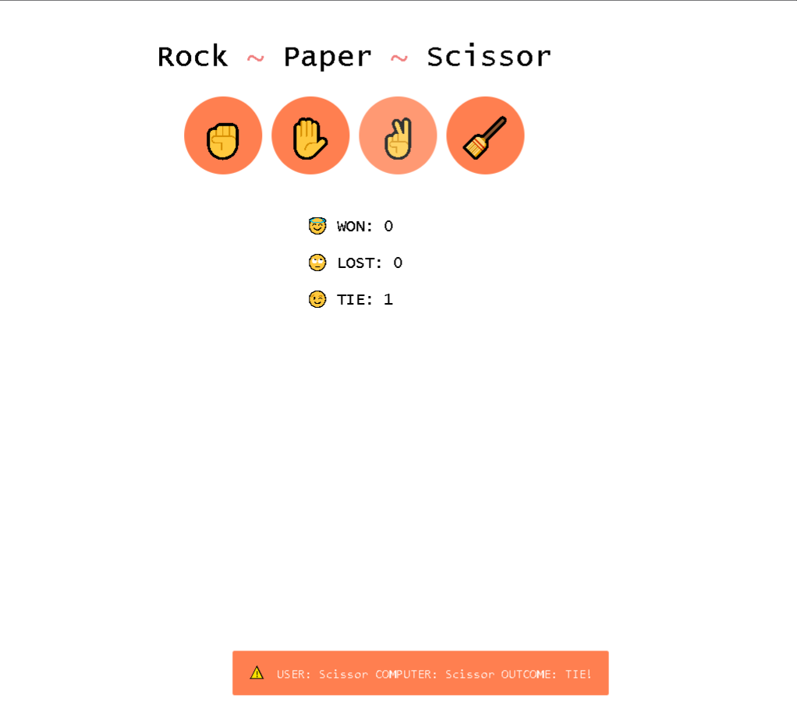

# Rock Paper Scissors Game 🎮

Welcome to **Rock Paper Scissors**, a simple yet fun game built with JavaScript, HTML, and CSS! Play against the computer and test your luck in this classic game of chance.



## 🚀 Project Overview

This project is a web-based version of the popular Rock Paper Scissors game, currently a work in progress. Players can choose from "Rock," "Paper," or "Scissors," and the computer randomly selects one as well. The game follows the standard rules:

- **Rock beats Scissors**
- **Scissors beats Paper**
- **Paper beats Rock**

Each round, the player can see if they win, lose, or draw.

## 🛠️ Technologies Used

- **HTML**: For the structure and layout of the game.
- **CSS**: For styling and making the game look engaging.
- **JavaScript**: To add the game logic and interactivity.

## 🎮 How to Play

1. Choose either **Rock**, **Paper**, or **Scissors** by clicking the respective button.
2. The computer will randomly select one of the options.
3. The result of each round (win, lose, or draw) is displayed immediately.
4. Play as many rounds as you want!

## 🔗 Live Demo

A live demo will be available soon! Stay tuned until the final version of the game is complete.

## 📂 Project Structure

```plaintext
js-rockpaperscissor/
├── index.html       # The main HTML file for structure of game
├── style.css        # The CSS file for styling
├── script.js        # The JavaScript file for game logic
└── README.md        # Project information and instructions


## 📧 Contact

Created by [github](https://github.com/jdsteadycode) - feel free to reach out!
```
